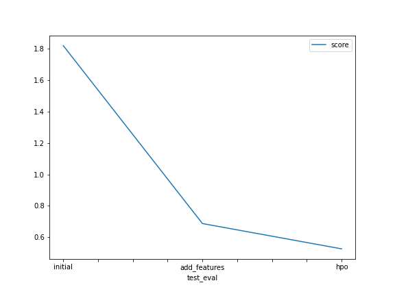

# Report: Predict Bike Sharing Demand with AutoGluon Solution
#### Rishika Garg

## Initial Training
### What did you realize when you tried to submit your predictions? What changes were needed to the output of the predictor to submit your results?
+ Trained the model using AutoGluon’s Tabular Prediction while performing the task I realized that in order to be able to submit my results to kaggle I needed to replace the negative numbers with 0, to make this happen  I took the count on how many negative scores predictor returned and then I set all the negative predictions to 0. 

### What was the top ranked model that performed?
+ The WeightedEnsemble_L3 model that used the data with newly added features performed better than others

## Exploratory data analysis and feature creation
### What did the exploratory analysis find and how did you add additional features?
+ To add more features I divided the datetime in month, day, year and hour and also transformed the season and weather features to categorical

### How much better did your model preform after adding additional features and why do you think that is?
+ Model performed better after adding the additional features. RMSE score reduced from 1.78821 to  0.6561. Which is around 63% improvement.I think this happened because additional features proved to be good predictors of target value in this case.

## Hyper parameter tuning
### How much better did your model preform after trying different hyper parameters?
+ Hyper parameter tuning didn't help much, the RMSE score was found to be degraded as RMSE score increased from 0.6561(EDA) to 1.26426(hyper parameter tuning)

### If you were given more time with this dataset, where do you think you would spend more time?
+ I would spend my time by evaluating using different model algorithms like Random Forest, XGBoost etc. Choose the best among these models and do hyper parameter tuning to further improve the results. I would also try to perform feature engineering dropping irrelevant features, feature scaling etc. I would compare my model against the best performing model on kaggle and will try to reach the benchmark. 

### Create a table with the models you ran, the hyperparameters modified, and the kaggle score.
+ Table
 

|model|hpo1|hpo2|hpo3|score|
|--|--|--|--|--|
|initial|default_vals|default_vals|default_vals|1.78821|
|add_features|default_vals|default_vals|default_vals|0.6561|
|hpo|num_leaves: lower=26, upper=66|dropout_prob: 0.0, 0.5|num_boost_round: 100|1.26426|

### Create a line plot showing the top model score for the three (or more) training runs during the project.
+ Line plot showing the top model score for the three (or more) training runs

### Create a line plot showing the top kaggle score for the three (or more) prediction submissions during the project.
+ Line plot showing the top model score for the three (or more) prediction submissions

## Summary
+ Developed a regression model to forecast bike demand based on historical data from bike sharing. I began by analysing the features by plotting sample rows and employing the pandas describe method. Then I created the first model with the default parameters. After training the model, I obtained the initial RMSE score. This was the first benchmark set.

+ The following step was to conduct EDA and analyse data patterns in features. Based on the plots, I decided to engineer existing features by changing the dtype from numeric to categorical and adding new features to capture time element information for each record. The model was then trained, which improved the RMSE Kaggle score on test data by more than 60%.

+ After hyperprameter tuning the model degraded as it's RMSE score on kaggle was increased. I think with more options for hyperparameters and increased duration for model training I can get better model score.

+ Finally, I compared the Kaggle scores of all trained models and plotted these scores against hyperparameter settings to assess relative performance improvement or degradation.

